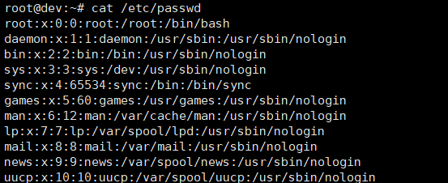
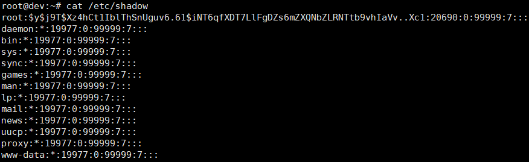
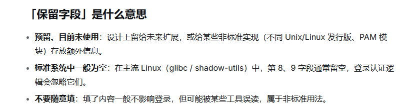
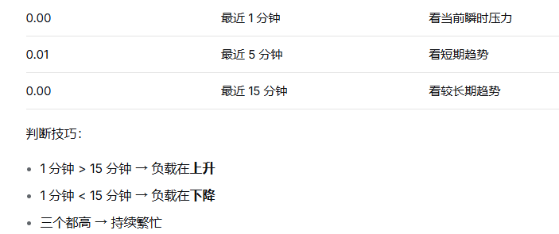
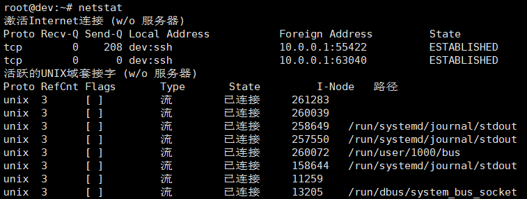
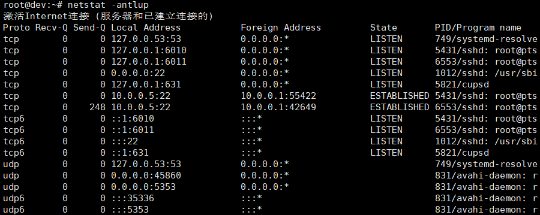
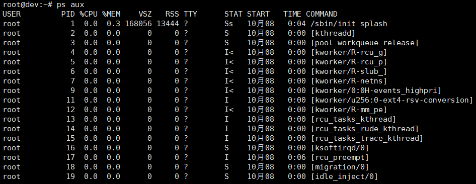

# Linux系统入侵排查

## 一，账号安全

> 用户信息文件：/etc/passwd
>



列表格式为，acc:pwd:UID:GID:GECOS:directory:shell

用户名:密码（x代表密码占位符，表示该密码在/etc/shadow中）:用户ID:组ID:用户说明:用户家目录:登录之后的shell目录

------

一些细节说明：

- /etc/passwd 任何用户都能看，但只有 root 可以更改；

- /usr/sbin/nologin 代表用户无法通过系统登录界面及ssh远程终端登陆，也无法通过su命令进行
  用户切换；
- 除root用户家目录在/root目录外，其他可登陆普通用户家目录在 /home/用户名 ，特殊的无法登
  陆用户，如apache服务用户www-data，家目录在 /var/www
- /bin/zsh 、/bin/bash 、 /bin/sh 都是常见的登陆shell，当然也会见到带/usr前缀的目录，例如
  /usr/bin/bash

**排查思路**：是否存在可疑用户，是否存在除root外其他uid=0的用户

> 用户影子文件 /etc/shadow



用户名:加密密码:最后修改时间:最小间隔:最大间隔:警告天数:失效天数:保留字段:保留字段

```bash
###解释
• 用户名：root
• 加密密码：$y$j9T$...，使用 yescrypt 算法（$y$ 前缀）哈希后的密码
			*，表示该账户被锁定，无法用密码登录
• 最后修改时间：20690，从 1970-01-01 起算的第 20690 天（约 2026-08-27）
• 最小间隔：0，密码可随时修改
• 最大间隔：99999，密码几乎永不过期
• 警告天数：7，过期前 7 天开始提醒
• 失效天数：空，账户不会在密码过期后被禁用
• 保留字段：空
• 保留字段：空
```

------

Ds对**保留字段**的解释：



------

一些细节说明：

- /etc/shadow 仅root用户可读写
- 密码有效期、密码修改到期的警告天数等策略可以为空，或默认的99999（无限制）
- /etc/shadow 并不是用户配置文件，如果仅把后门用户插入到此文件是无法生效的。
- 一些排查命令

```bash
1、查询特权用户（uid=0）
root@dev:~# awk -F: '$3==0{print $1}' /etc/passwd

2、除root账号外，是否有其他未知账号存在sudo权限
root@dev:~# more /etc/sudoers | grep -v "^#\|^$" | grep "ALL=(ALL"
root	ALL=(ALL:ALL) ALL
## %前缀表示这是组，不是用户
%admin ALL=(ALL) ALL  #允许 admin 用户组成员在任何主机上以任意用户身份，执行任意命令
%sudo	ALL=(ALL:ALL) ALL  #允许 sudo 组成员以任意用户:任意组身份运行任意命令
```

`root`：用户名；

`ALL=(ALL:ALL) ALL` 允许root在任何主机上，以任何用户：任何组身份，运行任何命令

```bash
3、禁用或删除多余及可疑账号
usermod -L user		#禁用账号，账号无法登录，/etc/shadow第二栏为!开头
userdel user		#删除user用户
userdel -r user		#将删除user用户，并且将 /home 目录下的user目录一并删除

4、常见命令
who		#查看当前登录用户（tty本地登录，pts远程登录）
w		#查看系统信息，想知道最近一次执行了什么命令

root@dev:~# uptime
 21:46:18 up 13:55,  3 users,  load average: 0.00, 0.01, 0.00
系统当前时间   已运行13时22分  登录用户数（不是3个用户，而是三个会话）  负载平均值（最近1min,5min,15min）
```

负载分析技巧：



## 二，历史命令

Linux系统里，执行过命令的用户会在自己的家目录下，生成相应的历史命令记录文件
如**.bash_history**、.zsh_history 、.sh_history

- 主要分析是否执行过恶意操作
- 当安全事件发生的时候，就可以通过查看每个用户所执行过的命令，来分析该用户是否有执行恶意
  命令，如果发现哪个用户执行过恶意命令，那么我们就可以锁定这个线索，去做下一步的排查

## 三、异常端口与进程

`netstat`：不带参数时，默认显示已建立的非监听连接 + 活跃的 UNIX 域套接字。



| 字段                | 第1行             | 含义                                     |
| :------------------ | :---------------- | :--------------------------------------- |
| **Proto**           | tcp               | 协议                                     |
| **Recv-Q**          | 0                 | 接收队列积压字节数，0 = 已全部被程序读走 |
| **Send-Q**          | 208               | 发送队列积压字节数                       |
| **Local Address**   | dev（主机名）:ssh | 本机 `dev` 的 **22 端口**（ssh = 22）    |
| **Foreign Address** | 10.0.0.1:55422    | 对端 IP 和端口                           |
| **State**           | ESTABLISHED       | 连接已建立，正在通信                     |

------

**UNIX 域套接字**是同一台机器内进程间通信（IPC）用的，不经过网络。

| 字段       | 含义                                                         |
| :--------- | :----------------------------------------------------------- |
| **Proto**  | unix，表示 UNIX 域套接字                                     |
| **RefCnt** | 引用计数，3 表示有 3 个进程/引用正在用这个套接字             |
| **Flags**  | 标志，`[ ]` 为空，通常表示无特殊标志（如 ACC 表示需传凭证）  |
| **Type**   | `流` = SOCK_STREAM（面向连接，类似 TCP）；也可能是 `数据报`（SOCK_DGRAM，类似 UDP） |
| **State**  | `已连接` = CONNECTED；还可能是 `监听`（LISTENING）           |
| **I-Node** | 内核中该套接字的 inode 编号，唯一标识                        |
| **路径**   | 套接字文件路径；**空的表示匿名套接字**（未绑定文件路径，仍可通信） |

------

```bash
netstat -antulp
a #所有状态的连接
n #十进制数显示IP地址
t #显示 tcp 协议
u #显示 udp 协议
l #显示监听连接
p #显示PID
```



Proto：网络协议。

Reve-Q：接收队列中的数据包数量；Sed-Q：发送队列中的数据包数量。

Local Address：表示本地地址（IP地址和端口号），格式为：IP地址:端口号

​		127.0.0.1：代表端口只监听本地，其他机器无法连接。

​		10.0.0.5：代表端口只监听在 10.0.0.5 IP（eth0网卡）上，只有能访问到 10.0.0.5 的机器才能访问

​		0.0.0.0：代表端口监听在所有的接口 IP 上，表示所有 IPv4 地址计算机均可访问（当然前提是目标能连通该计算机）

​		：：：  等价于0.0.0.0，它是 IPv6 地址。

Foreign Address：表示远程地址，格式同上。

​		如果以  -   或者 ：：开头，则表示没有远程地址（即表示尚未连接 或 已经断开连接）

State：表示连接状态，通常包括：已建立（ESTABLISHED），监听（LISTEN），等待（WAIT），关闭（CLOSE）等。

PID / Program name：表示与网络连接相关联的进程的ID和名称。有些时候可能显示进程的ID而不显
示进程的名称。

------

- **排查思路**：
  - 发现可疑IP，上报或检测威胁情报 , 确认后停止进程 kill -9 PID
  - 发现可疑连接进程，ls -l /proc/PID/exe 或 file /proc/PID/exe 查看进程具体运行的文件路径 ，如
    果发现是病毒文件，及时上报并进行留存与删除

```bash
## 查看某个进程（PID）正在运行的可执行文件是哪一个
root@dev:~# ls -l /proc/1012/exe
lrwxrwxrwx 1 root root 0 10月  6 22:33 /proc/1012/exe -> /usr/sbin/sshd
```

检查异常进程：ps aux



```bash
USER  #表示进程所属用户
PID   #进程的pid号
%CPU  #表示进程使用的CPU资源百分比
%MEM  #表示进程使用的内存资源百分比
VSZ   #表示进程的虚拟内存大小（以 KB 为单位）
RSS   #表示进程的实际内存大小
```


