# 一、排查思路与流程

- 常见事件分类：

Web入侵：网页挂马、主页篡改、WebShell

系统入侵：病毒木马、勒索软件、远控后门

网络攻击：DDOS攻击、DNS劫持、ARP欺骗

排查流程：

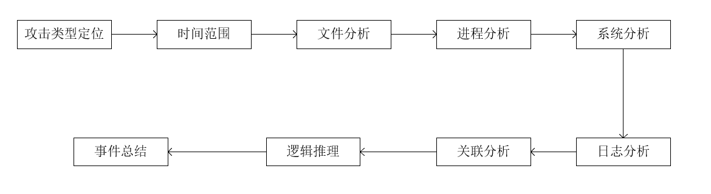

## 1，账号安全

1. 正常用户：net user 能看到

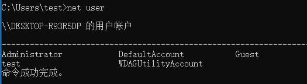

2. 隐藏账户：以 $ 结尾，net user 看不到，但是在控制面版、lusrmgr.msc、用户组中能看到

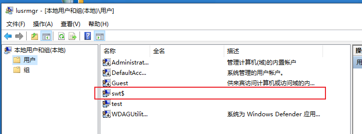

3. 影子用户：只有注册表中能看到

win + R ，regedit 打开注册表编辑器。（如果第二个SAM打不开就鼠标右键权限，选择Adminsrtators用户组给完全控制权限。）

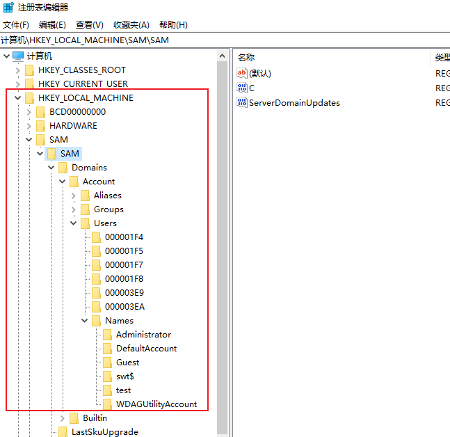

使用D 盾排查可疑账户

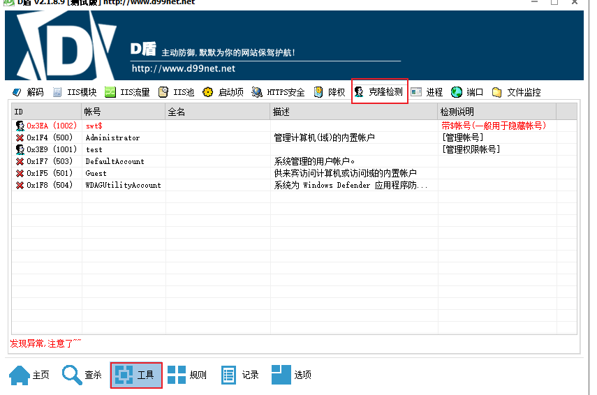

------

## 2，异常端口与进程

检查端口连接情况，是否有远程连接、可以连接。

```txt
查看目前的网络连接
netstat -ano
```

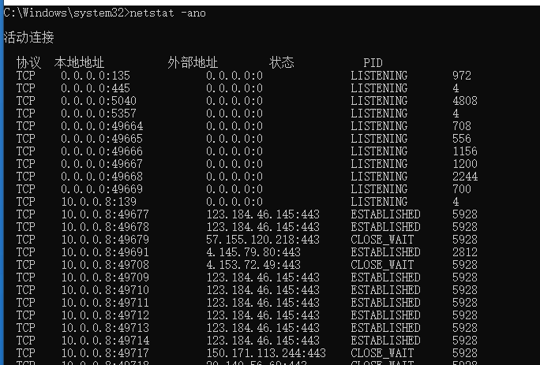

接下来对上图一些内容解释。

```bash
本地地址：0.0.0.0:135  #所有的Ipv4地址（电脑上所有能操控的 cmd->ipconfig中的）监听 135端口

外部地址：0.0.0.0:0	#我谁都没连
	    57.155.120.218：443	#我连接了57.155.120.218，可能是访问了网站
	    
CLOSE_WAIT	#收到对方的FIN并回了ACK后就会进入这个状态
LISTENING	#监听连接
ESTABLISHED	#保持连接状态
```

------

查看目前的网络连接和进程所属文件

```txt
netstat -anob	# 必须是管理员权限才能执行
```

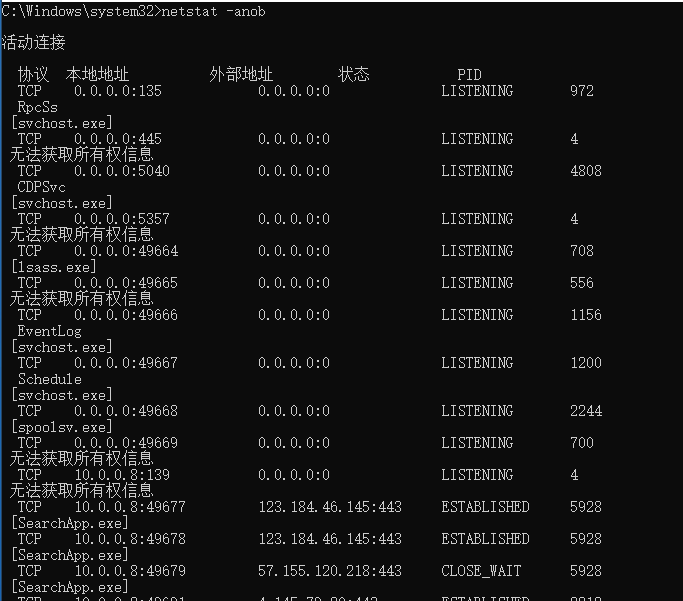

通过PID号结合任务管理器定位文件。


例如这个5928

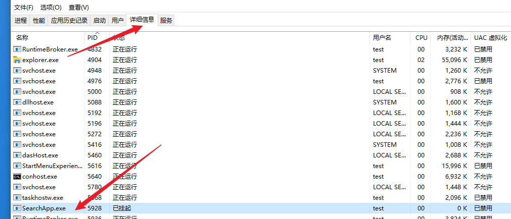

接着右键然后点击 “ 打开文件所在的位置 ”

如果您怀疑某个进程有问题但无法确认可以去微步在线搜下IP：57.155.120.218

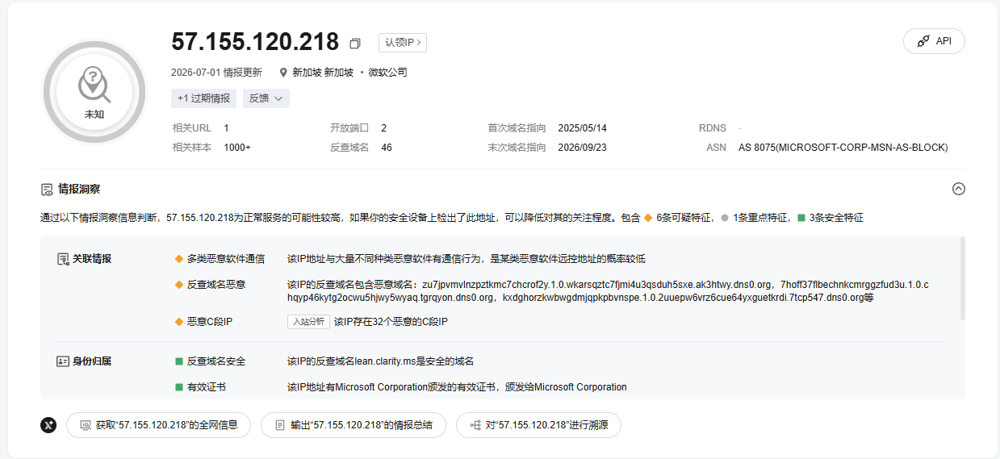

或者到twitter上搜索。

也可以通过tasklist命令定位进程文件。

```txt
tasklist | findstr "PID"
```

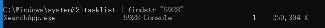

终止异常进程

```txt
tasklist /f /pid PID
##实际环境中黑客入侵会有多个文件相互唤醒。
```

------

或者通过D盾，主要看没有签名的

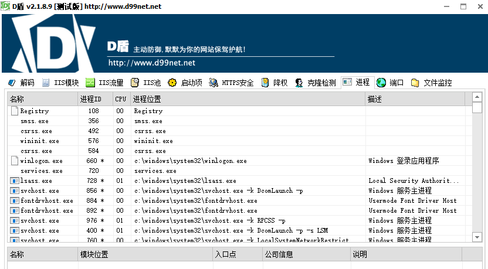

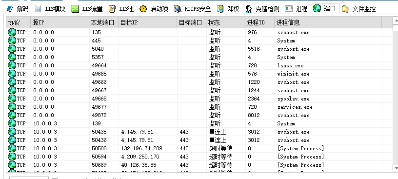

------

通过 微软官方的 Process Exploer

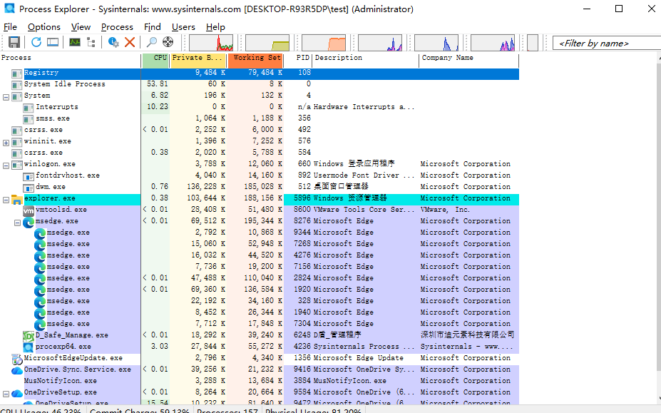

还有一个火绒剑独立版，目前没搜集到纯净版，主要分析以下类型进程

```txt
- 没有签名验证信息的进程
- 没有描述信息的进程
- 进程的属主
- 进程的路径是否合法
- CPU或内存资源占用长时间过高的进程
```

## 3，启动项

通过注册表，win + R : regedit，是 Windows中的一个重要的数据库，用于 存储系统和应用程序的设置信息。

用户自启动项（开机自启动，黑客很多时候会把病毒文件设置开机自启）

1）计算机\HKEY_CURRENT_USER\SOFTWARE\Microsoft\Windows\CurrentVersion\Run

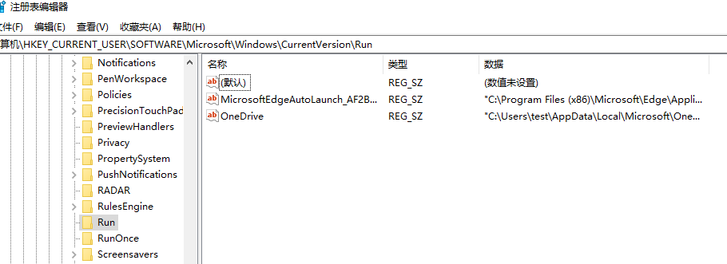

2）计算机\HKEY_LOCAL_MACHINE\SOFTWARE\Microsoft\Windows\CurrentVersion\Run

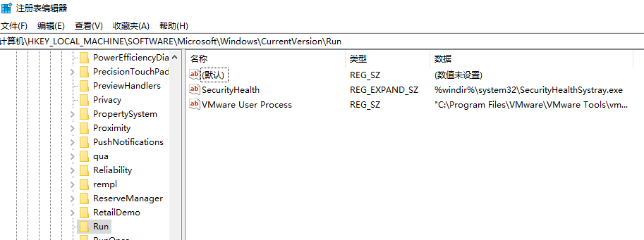

3）计算机\HKEY_LOCAL_MACHINE\SOFTWARE\Microsoft\Windows\CurrentVersion\RunOnce

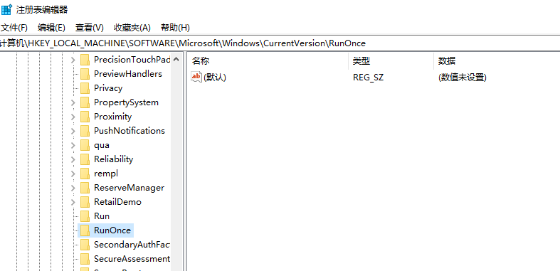

------

**镜像劫持**：打开微信，结果变成打开木马。

计算机\HKEY_LOCAL_MACHINE\SOFTWARE\Microsoft\Windows NT\CurrentVersion\Image File Execution Options

------

通过 msinfo32 命令查软件环境，其中包括：系统驱动、已签名驱动、环境变量、网络连接、运行任务、服务、启动程序等。

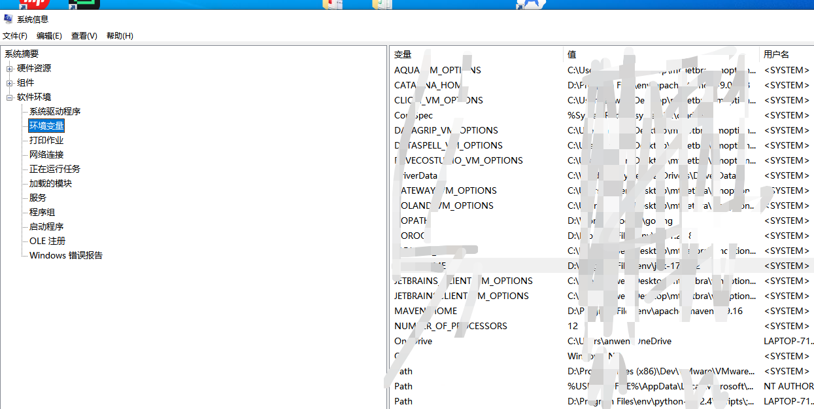

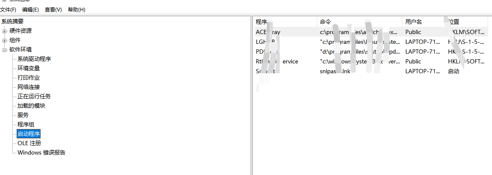

导出系统信息。

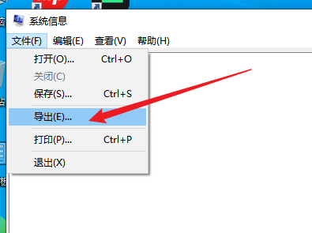

## 4，计划任务

- 检查方法：

  - 点击【控制面板】->【系统和安全】->【管理工具】->【任务计划】，查看计划任务属性，可以发现木马文件的路径。

  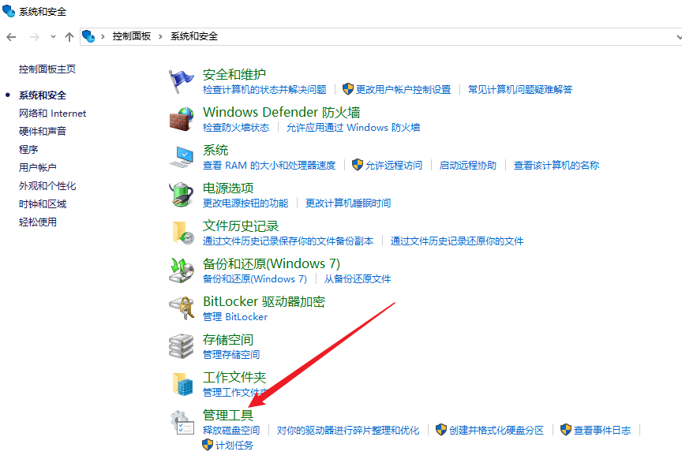

  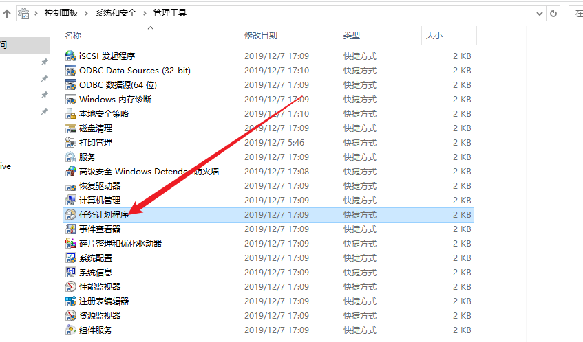

  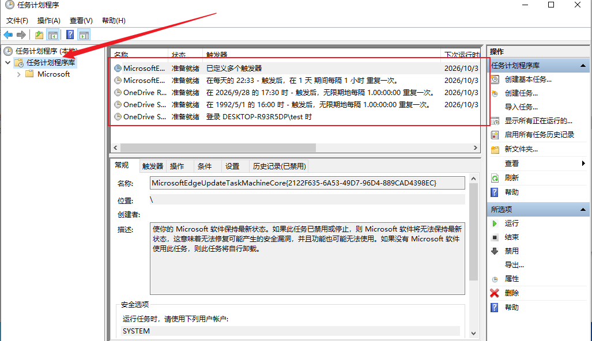

  - win + R：taskschd.msc

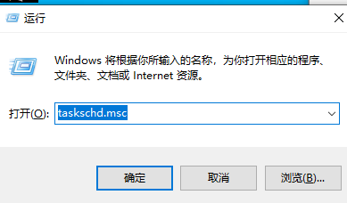

## 5，异常服务

cmd执行：`services.msc`

注意服务状态和启动类型，检查是否有异常服务

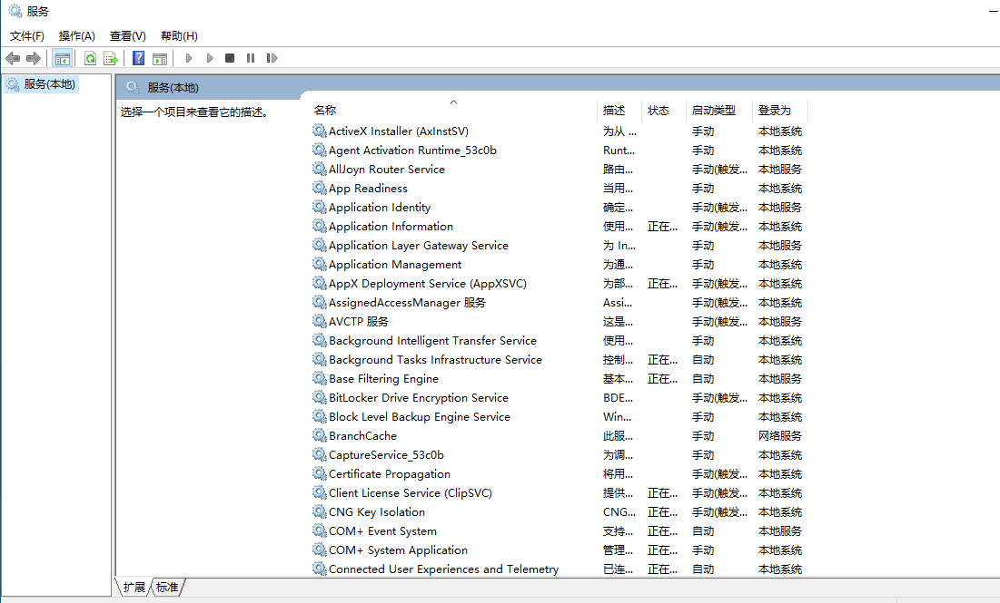

拓展：命令行方式 sc query type= service （可读性相当差）

## 6，检查系统相关信息

### 1）查看系统版本以及补丁信息

cmd：

```cmd
systeminfo
```

主机名:           DESKTOP-R93R5DP
OS 名称:          Microsoft Windows 10 专业版
OS 版本:          10.0.19045 暂缺 Build 19045
OS 制造商:        Microsoft Corporation
OS 配置:          独立工作站
OS 构建类型:      Multiprocessor Free
注册的所有人:     test
注册的组织:
产品 ID:          00331-10000-00001-AA673
初始安装日期:     2026/8/11, 10:15:19
系统启动时间:     2026/9/29, 23:35:18
系统制造商:       VMware, Inc.
系统型号:         VMware7,1
系统类型:         x64-based PC
处理器:           安装了 2 个处理器。
                  [01]: AMD64 Family 25 Model 80 Stepping 0 AuthenticAMD ~3294 Mhz
                  [02]: AMD64 Family 25 Model 80 Stepping 0 AuthenticAMD ~3294 Mhz
BIOS 版本:        VMware, Inc. VMW71.00V.16722896.B64.2008100651, 2020/8/10
Windows 目录:     C:\Windows
系统目录:         C:\Windows\system32
启动设备:         \Device\HarddiskVolume1
系统区域设置:     zh-cn;中文(中国)
输入法区域设置:   zh-cn;中文(中国)
时区:             (UTC+08:00) 北京，重庆，香港特别行政区，乌鲁木齐
物理内存总量:     4,095 MB
可用的物理内存:   1,301 MB
虚拟内存: 最大值: 5,183 MB
虚拟内存: 可用:   2,501 MB
虚拟内存: 使用中: 2,682 MB
页面文件位置:     C:\pagefile.sys
域:               WORKGROUP
登录服务器:       \\DESKTOP-R93R5DP
修补程序:         安装了 12 个修补程序。
[01]: KB5066130
[02]: KB5066135
[03]: KB5011048
[04]: KB5011050
[05]: KB5015684
[06]: KB5072653
[07]: KB5126256
[08]: KB5071959
[09]: KB5014032
[10]: KB5028380
[11]: KB5066790
[12]: KB5071982
网卡:             安装了 1 个 NIC。
                  [01]: Intel(R) 82574L Gigabit Network Connection
                      连接名:      Ethernet0
                      启用 DHCP:   否
                      IP 地址
[01]: 10.0.0.3
[02]: fe80::7ed0:b139:367c:e3cd
Hyper-V 要求:     已检测到虚拟机监控程序。将不显示 Hyper-V 所需的功能。

### 2）查看可疑目录及文件信息

- Win + R ： `%UserProfile%\Recent`，分析最近打开的可疑文件
- 在服务器各个目录根据文件夹内列表时间进行排序，查找可疑文件
- 检查 C:\Windows\Temp 目录
- 杀毒软件全盘扫描