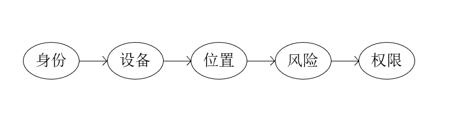

## 零信任

永不默认信任，始终验证。



## 零信任通常靠哪些能力实现？

```bash
-> 身份认证 
	账号密码 + 多因素认证
-> 设备可信 
	设备是否注册、加密、安装安全软件、系统版本是否安全
-> 最小权限 
	只给完成工作所需的最小权限（按角色、资源、场景精细授权）
-> 持续验证 
	行为可疑会重新认证或临时收紧权限
-> 微隔离 
-> 日志监控
	记录分析
```

## 落地方式？

```bash
核心系统先加多因子认证；统一身份管理入口；梳理权限，最小授权；设备合规；访问控制动态调整；
```

## 安全架构体系

```bash
身份系统 - 终端安全 - 访问代理 - 权限管理 - 日志监控
```

## 总结

零信任不是一个单点工具，而是一套持续建设的安全体系。更精细、动态地保证企业安全。