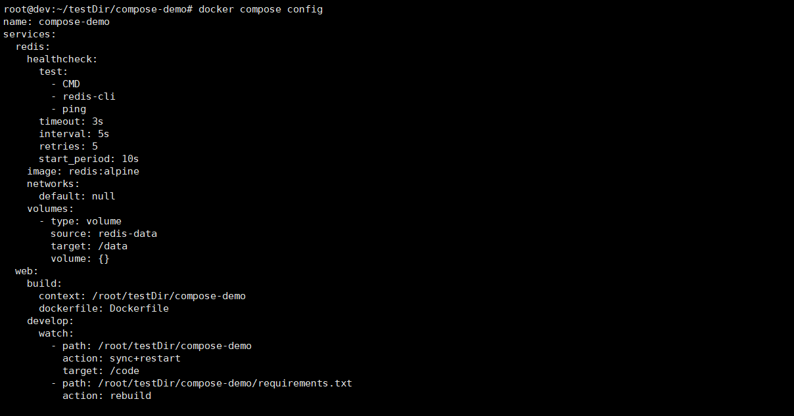
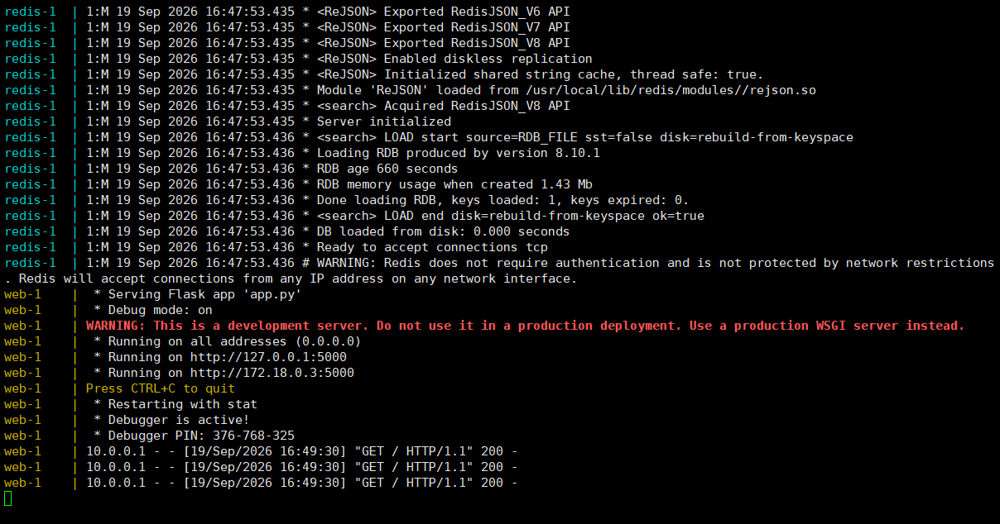
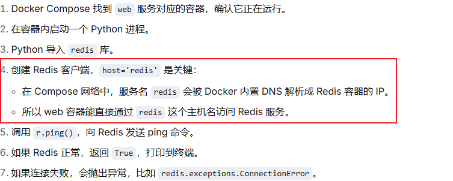
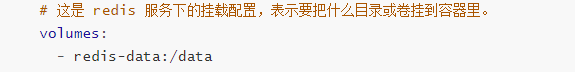

# 一、概念及安装

## 1，用途？

Docker Compose 是一款用于定义和运行多容器应用的工具。 它是解锁高效开发与部署体验的关键。Compose简化了对整个应用栈的控制，使得在单一YAML配置文件中轻松管理服务、网络和卷。然后，只需一个命令，你就能创建并启动所有服务 从你的配置文件里。Compose 工作涵盖所有环境——生产、预发布、开发、测试等 以及CI工作流程。它还包含管理应用整个生命周期的命令：

- 启动、停止和重建服务
- 查看运行服务状态
- 流式传输运行服务的日志输出
- 在服务上运行一次性命令

## 2，compose工作原理

使用 Docker Compose 时，你使用一个称为 [Compose 文件](https://docs.docker.com/compose/intro/compose-application-model/#the-compose-file)的 YAML 配置文件来配置应用的服务，然后用 [Compose CLI](https://docs.docker.com/compose/intro/compose-application-model/#cli) 创建并启动所有服务。Compose文件的默认路径是（优先）或放置在工作目录中的路径。 Compose 还支持并向后兼容早期版本。 如果两个文件都存在，Compose 更倾向于使用规范文件。`compose.yaml``compose.yml``docker-compose.yaml``docker-compose.yml``compose.yaml`、

## 3，docker CLI

Docker CLI 允许您通过命令及其子命令与 Docker Compose 应用交互。如果你用的是 Docker 桌面，默认包含 Docker Compose CLI。

关键命令：

```bash
# 启动文件中定义的所有服务
docker compose up
# 停止并移除正在运行的服务
docker compose down
# 如果你想监控运行容器的输出和调试问题，可以通过以下方式查看日志：
docker compose logs
# 列出所有服务及其当前状态：
docker compose ps
```

## 4，安装在Linux中

手动安装Plugin插件。

```bash
$ DOCKER_CONFIG=${DOCKER_CONFIG:-$HOME/.docker}

$ mkdir -p $DOCKER_CONFIG/cli-plugins

$ curl -SL https://github.com/docker/compose/releases/download/v5.5.0/docker-compose-linux-x86_64 -o $DOCKER_CONFIG/cli-plugins/docker-compose
# 对二进制文件应用可执行权限
$ chmod +x $DOCKER_CONFIG/cli-plugins/docker-compose

# 测试安装
$ docker compose version

# 在用户的家目录下
root@dev:~# tree .docker/
.docker/
└── cli-plugins
    └── docker-compose
```

# 二、快速入门

项目结构

./
├── app.py
├── compose.yaml
├── Dockerfile
└── requirements.txt

## 1，搭建项目

我们本次的工作目录：/root/testDir/compose-demo，在这个目录下创建并编辑文件 app.py

```bash
## 粘入以下内容
import os
import redis
from flask import Flask

app = Flask(__name__)
cache = redis.Redis(
    host=os.getenv("REDIS_HOST", "redis"),
    port=int(os.getenv("REDIS_PORT", "6379")),
)

@app.route("/")
def hello():
    count = cache.incr("hits")
    return f"Hello from Docker! I have been seen {count} time(s).\n"
```

应用通过环境变量读取 Redis 连接信息，默认设置合理，开箱即用。

创建并编辑文件 `requirements.txt`

```bash
flask
redis
```

创建并编辑文件：`Dockerfile`：定义如何构建一个镜像

```bash
# syntax=docker/dockerfile:1

# Build an image with the Python 3.12 image
FROM python:3.12-alpine

# 容器内部的一个真实目录，实际存储大概在/var/lib/docker/overlay2/.../diff/code
WORKDIR /code

# Set environment variables used by the `flask` command
ENV FLASK_APP=app.py
ENV FLASK_RUN_HOST=0.0.0.0

# Install `gcc` and other dependencies
RUN apk add --no-cache gcc musl-dev linux-headers

# Copy `requirements.txt`
COPY requirements.txt .

# Install the Python dependencies
RUN pip install -r requirements.txt

# 把构建上下文里的所有文件复制到 /code
COPY . .

EXPOSE 5000

# Set the default command for the container to `flask run --debug`
CMD ["flask", "run", "--debug"]
```

创建并编辑文件：.env

```bash
# 主机端口映射容器端口 5000，配置于 compose.yaml 文件中
APP_PORT=8000
REDIS_HOST=redis
REDIS_PORT=6379
#######################################
Docker 在构建映像时会把项目目录里的所有内容都发送到守护进程。 没有 ，这包括你的文件（可能包含秘密）和 任何缓存的Python字节码。排除它们能让构建速度快，避免无意中避免 将敏感值烘焙到图像图层中。
```

在不编辑YAML的情况下更改环境间的数值
避免将密钥提交到版本控制
跨多项服务的重用值

创建并编辑文件：.dockerignore

```bash
.env
*.pyc
__pycache__
redis-data
```

## 2，定义并启动您的服务

在您的项目目录中进行

```bash
vim compose.yaml

## 粘贴以下内容 ##
services:
  web:
    build: .
    ports:
      - "${APP_PORT}:5000"
    environment:
      - REDIS_HOST=${REDIS_HOST}
      - REDIS_PORT=${REDIS_PORT}
      
  redis:
    image: redis:alpine
```

该 compose 文件定义了两种服务：

1）该服务使用由当前目录中构建的镜像。他会将主机上的端口映射到Flash默认监听的容器端口。web Dockerfile 8000 5000

2）该服务使用 Docker Hub 注册表拉取的公开 Redis 映像。redis。有关该文件的更多信息请参考：https://docs.docker.com/compose/intro/compose-application-model/

我们本次实验当下载alpine镜像时发生了DNS无法解析的错误，后通过如下方式解决：

```bash
# 编辑 Docker Engine 配置文件
vim /etc/docker/daemon.json

# 添加一段DNS解析服务器（最终文件内容如下）
{
  "dns": [
    "8.8.8.8",
    "114.114.114.114"
  ],
  "registry-mirrors": [
    "https://docker.m.daocloud.io",
    "https://docker.1ms.run",
    "https://docker.xuanyuan.me"
  ]
}

# 重新启动 docker 服务
systemctl restart docker

# 验证容器中的 DNS
docker run --rm alpine cat /etc/resolv.conf
```

启动您的应用：

```bash
docker compose up [--build]

## 选项 --build 的说明
不加 --build：	直接启动现有容器。如果镜像不存在，则自动构建；如果镜像已存在，则直接使用，无论代码是否更改。

加上 --build：先强制重新构建所有服务的镜像（忽略已有缓存），然后再启动容器。确保运行的容器使用的是最新的代码和依赖。
```

只需一个命令，你就能从配置文件创建并启动所有服务。Compose 构建你的网页镜像，拉取 Redis 镜像，启动两个容器。


我们访问虚拟机 8000 端口


# 三、基础进阶

在继续之前先停止您的应用

```bash
docker compose down
```

## 1，通过健康检查解决启动竞态问题

更新：`compose.yaml`

```bash
services:
	web:
		build:
		ports:
			- "${APP_PORT}:5000"
		environment:
			- REDIS_HOST=${REDIS_HOST}
			- REDIS_HOST=${REDIS_HOST}
		depends_on:
			redis:
				condition: service_healthy
			
	redis:
		image: redis:alpine
		healthcheck:
			test: ["CMD","redis-cli","ping"]
			interval: 5s
			timeout: 3s
			retries: 5
			start_period: 10s
```


```bash
...
...
Container compose-demo-redis-1 Healthy
...
...
```

## 2，启动 Compose Watch以获取实时更新

没有 Compose Watch，每次代码更改都需要停止堆栈、重建映像和重启容器。Compose Watch 通过自动同步修改文件到运行中的容器，消除了这种循环。

更新 compose.yaml文件

```bash
services:
  web:
    build: .
    ports:
      - "${APP_PORT}:5000"
    environment:
      - REDIS_HOST=${REDIS_HOST}
      - REDIS_PORT=${REDIS_PORT}
    depends_on:
      redis:
        condition: service_healthy
    develop:
      watch:
        - action: sync+restart
          path: .
          #这个路径路径同步于Dockerfile文件中的 WORKDIR
          target: /code
        - action: rebuild
          path: requirements.txt

  redis:
    image: redis:alpine
    healthcheck:
      test: ["CMD", "redis-cli", "ping"]
      interval: 5s
      timeout: 3s
      retries: 5
      start_period: 10s
```

再开一个窗口修改app.py的内容

```bash
......
return f"Hello from Compose Watch! I have been seen {count} time(s).\n"
...
```

直接刷新网页发现资源已自动更新，无需在重新 up 一下。

## 3，持久化带有命名卷的数据

每次你停止并重新开始堆栈，访问计数器都会重置为零。Redis 数据 它生活在容器内，因此当容器被移除时它会消失。一个有名的 Volume 通过将数据存储在主机上，超出容器生命周期来解决这个问题。

更新 `compose.yaml`

```yaml
services:
  web:
    build: .
    ports:
      - "${APP_PORT}:5000"
    environment:
      - REDIS_HOST=${REDIS_HOST}
      - REDIS_PORT=${REDIS_PORT}
    depends_on:
      redis:
        condition: service_healthy
    develop:
      watch:
        - action: sync+restart
          path: .
          target: /code
        - action: rebuild
          path: requirements.txt

  redis:
    image: redis:alpine
    volumes:
    # redis-data 一份由 docker 管理的 命名卷，/data Redis容器里的数据目录Redis 默认会把持久化文件写到这里，比如 dump.rdb。
    # redis-data:/data：把命名卷挂到 Redis 容器的 /data。
      - redis-data:/data
    healthcheck:
      test: ["CMD", "redis-cli", "ping"]
      interval: 5s
      timeout: 3s
      retries: 5
      start_period: 10s
# 顶层 volumes: redis-data:：向 Compose 注册这个命名卷。不存在就创建，存在就复用。
volumes:
  redis-data:
```

所以容器删了没关系，数据在 `redis-data` 这个卷里。下次再启动 Redis，还挂同一个卷，数据就回来了。

实际卷名命名规范通常是：`项目名_redis-data`

可以用如下命令查看：

```bash
root@dev:~/testDir/compose-demo# docker volume ls
DRIVER    VOLUME NAME
local     compose-demo_redis-data
```

```bash
docker compose up --watch
```

连续刷新10次页面。


```bash
# 移除容器，但不删除命名卷
docker compose down
```

停用后重新启动可以发现 redis 缓存的数据没有丢失。

```bash
docker compose down -v
# v 是 volumes（卷）的缩写
```

额外删除 Compose 文件里定义的命名卷和匿名卷，下次再启动，会创建一个新的空卷，计数器归零。

再次启动计数器归1


## 4，多个 compose 文件构建项目结构

随着应用的增长，单一的维护变得越来越困难。顶层元素允许你将服务拆分到多个文件中，同时保持它们作为 同样的应用。`compose.yaml include`

1，创建一个新文件 infra.yaml 并将 Redis 服务和卷迁移到其中。

```yaml
# 顶层键，表示定义了一个服务配置文件。
services:
  # 定义服务名称：redis，compose会为这个服务创建一个容器，默认情况下在compose的网络中其他服务可以用服务名redis来访问它
  redis:
    # 用 redis:alpine 这个镜像创建 Redis 容器。
    image: redis:alpine
    # 这是 redis 服务下的挂载配置，表示要把什么目录或卷挂到容器里。
    volumes:
      - redis-data:/data
    healthcheck:
      # exec形式，相当于在容器里运行：redis-cli ping
      test: ["CMD", "redis-cli", "ping"]
      # 每5s检查一次
      interval: 5s
      # 单次检查最多等 3 秒。
      timeout: 3s
      # 连续失败 5 次后，才把容器标记为 unhealthy。
      retries: 5
      # 在容器刚启动的这 10 秒内，即使健康检查失败，也不会计入 retries。
      start_period: 10s
      
# 顶层键，用来声明这个 Compose 项目里要用到的命名卷。
volumes:
  # 声明一个名叫 redis-data 的命名卷。
  redis-data:
```

2，更新 compose.yaml 使他包含 infra.yaml。

```yaml
include:
   - path: ./infra.yaml
services:
  web:
    #表示这个服务的镜像不是直接拉去而是从 当前目录 构建，Docker 会找这个目录下的 Dockerfile，然后执行构建。
    build: .
    #端口映射，格式通常是 宿主机端口:容器端口
    #${APP_PORT}，从环境变量读取，通常为同级目录下的 .env文件
    #容器服务“web”监听的端口
    ports:
      - "${APP_PORT}:5000"
    #给容器设置环境变量，web启动时能读到
    environment:
      #redis的服务名和端口号，这些值也通过 .env 文件读到，这样web应用就知道到哪里去连接redis
      - REDIS_HOST=${REDIS_HOST}
      - REDIS_PORT=${REDIS_PORT}
    #定义服务启动顺序和依赖条件
    depends_on:
      #在 infra.yaml 文件中定义了redis服务
      redis:
        #不只是等待redis启动并且要通过健康状态检查
        #也就是说，Redis 必须满足 healthcheck 里定义的 redis-cli ping 成功，状态变成 healthy 后，web 才会启动。
        condition: service_healthy
    #Docker Compose 的开发监视模式配置，配合 docker compose up --watch 使用。
    develop:
      watch:
          #同步文件后，重启容器里的服务。
        - action: sync+restart
          #监视当前目录下的文件变化
          path: .
          #把变化同步给容器里的code目录
          target: /code
          #一旦它变化，就重新构建镜像。
        - action: rebuild
          #专门监视这个文件
          path: requirements.txt
```

3，运行应用程序确认一切是否正常：

```bash
docker compose up --watch
```

Compose 在启动时会合并这两个文件。由于所有包含的服务共享相同的默认网络，服务仍可通过名称引用。这是一个简化的例子，但它展示了基本原理，以及如何使其更容易将复杂应用模块化为子 Compose 文件。

有关多个Compose文件的操作及操作的更多信息，请参见https://docs.docker.com/compose/how-tos/multiple-compose-files/

4，在继续前先停止堆栈

```bash
docker compose down
```

## 5，检查并调试你的运行栈

当你的 Compose 堆栈已经完整配置好之后，你**不用停掉任何容器**，就能查看容器内部发生了什么。

```bash
docker compose config
```



从所有服务流式日志输出。

```bash
docker compose logs -f

# 要跟踪单一服务的日志，后跟服务完整路径，例如：
docker compose logs -f http://localhost:8000

# 指定服务名跟踪日志
docker compose logs -f web
```



这种方式看日志当我们通过 Ctrl + C 退出时不会影响到服务的运行。

在运行中的容器中运行命令：`docker compose exec`

```bash
# docker compose exec 服务名称 要执行的命令，用来验证 Redis 相关环境变量是否已经正确传入容器。
docker compose exec web env | grep REDIS
```

**测试 web 容器是否能用服务名作为主机名访问Redis**

```bash
docker compose exec web python -c "import redis; r = redis.Redis(host='redis'); print(r.ping())"
```



检查 redis 计数器的实时值：

```bash
docker compose exec redis redis-cli GET hits
```

# 关于一些提法的解释

## 1，为什么官方翻译 docker compose down 用途为停止堆栈而不是停止容器？

在 Docker Compose 里，一个 compose.yaml 文件定义了一组服务，比如在我们的例子中：

```bash
web服务 --》 一个容器
redis服务 --》 一个容器
还有网络、数据卷等资源...
```

这些资源合在一起构成一个完整的应用。Docker生态里习惯把这种由多个容器、网络、卷组成的应用单元叫做一个 **stack（堆栈）**。所以“堆栈” = 这个应用的整体运行环境。

容器只是堆栈的一部分，一个堆栈可能包含多个容器，还有网络、卷等。docker compose down 不只是停止容器，他还会1）停止并删除所有容器；2）删除 Compose 创建的网络。3）默认保留命名卷（除非加 -v）

## 2，持久化数据卷映射位置



```bash
# 实际宿主机的目录
/var/lib/docker/volumes/<项目名>_redis-data/_data
```

