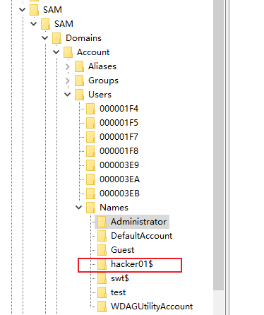
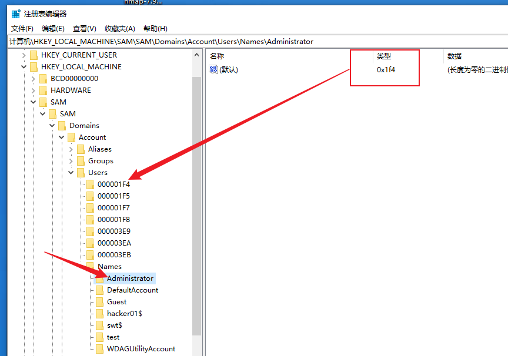
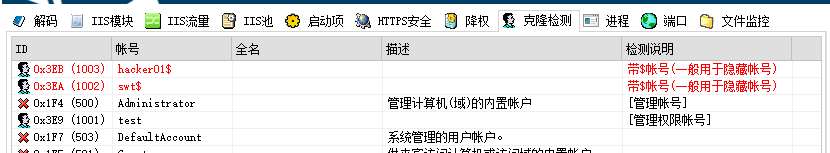
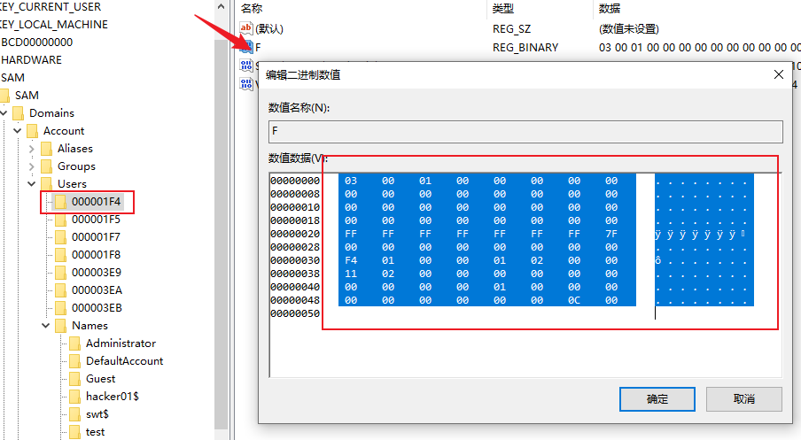
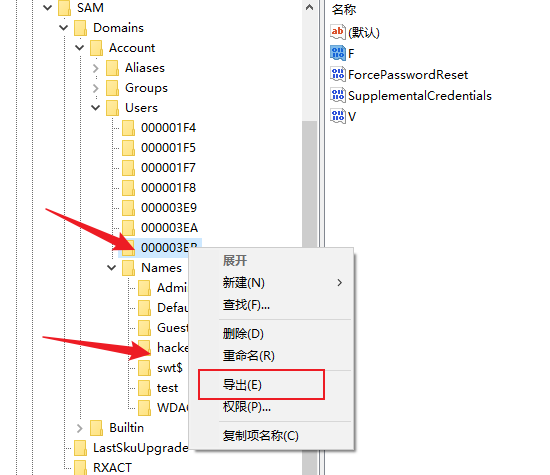
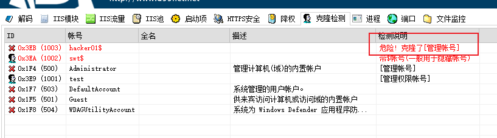

# 一、账户安全

## 1，创建隐藏用户

```cmd
net user hacker01$ passwd /add && net localgroup administrators hacker01$ /add
```

用户名：hacker01$ 密码：passwd
net localgroup administrators 将hacker01$添加到管理员用户组中

## 2，创建影子账户

在这之前需要先正常创建一个隐藏账户。



此时我们创建好了hacker01$账户。



我们点击 管理员账户可以看到类型 0x1f4，Users下正好有个对应文件。（此时D盾的显示结果如下）



此时双击进入到 000001F4文件夹中，双击 F 可以看见二进制数值，我们全选 ctrl + C复制。



同样的步骤我们进入到 hacker01$的 3EB目录中，修改 F 的二进制值粘贴刚替换为在管理员文件中复制的内容。点击确定。

然后右键两个将他们导出到桌面。



接着我们删掉 hacker01$ 账户。

```cmd
C:\Windows\system32>net user hacker01$ /del
命令成功完成。
```

此时刷新注册表，关于 hacker01$的两条注册信息就都没有了。（这里我们就不截图了）

接下来我们将刚才导出的注册表内容重新导入，直接双击即可。测试注册表内恢复。

